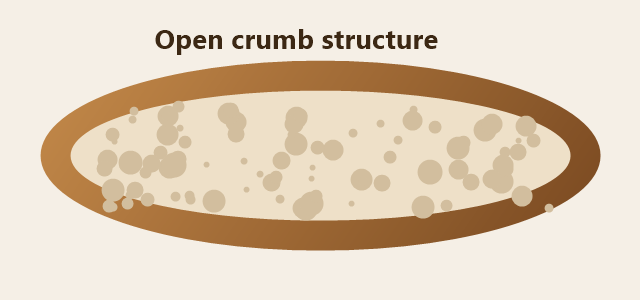

# The Chemistry of Bread

Bread is one of the oldest processed foods we still make by hand, and yet a
plain loaf hides a surprising amount of chemistry. Flour, water, salt, and a
handful of microbes are enough to produce something that rises, browns, and
smells of the thing we call *home*. This guide walks through **why** a loaf
behaves the way it does and then puts that theory to work in a single, forgiving
recipe you can repeat every weekend.

Everything here has been tested in an ordinary home kitchen with an ordinary
oven. Where a number matters — a temperature, a ratio, a rest time — it is
called out so you can adapt it to your own flour and climate.

## Table of Contents

- [Why Bread Rises](#why-bread-rises)
- [The Baker's Toolkit](#the-bakers-toolkit)
- [Method: A Country Loaf](#method-a-country-loaf)
- [Hydration at a Glance](#hydration-at-a-glance)
- [Automating the Baker's Math](#automating-the-bakers-math)
- [When Things Go Wrong](#when-things-go-wrong)
- [Flour, in Depth](#appendix-flour-in-depth)
- [Further Reading](#further-reading)

## Why Bread Rises

A loaf rises because it is quietly full of gas. Two processes work together to
create and trap that gas, and understanding them is the difference between a
dense brick and an open, airy crumb.

### Fermentation and Gas

Yeast and wild bacteria feed on the sugars in flour and release carbon dioxide,
CO<sub>2</sub>, as a by-product. That gas inflates thousands of tiny pockets in
the dough. Alongside the CO<sub>2</sub>, fermentation produces ethanol and a
family of acids that give sourdough its tang — most of the alcohol simply bakes
off, boiling away well before the loaf reaches its final internal temperature of
around 96&nbsp;°C.[^temp]

The warmer the dough, the faster the microbes work. A rough rule of thumb is
that fermentation roughly *doubles* in speed for every 8&nbsp;°C of extra warmth,
which is why the same recipe can take four hours in July and eight in January.

### Gluten, the Scaffolding

Gas is useless without something to hold it. When water meets flour, two
proteins — glutenin and gliadin — link into an elastic network called **gluten**.
Kneading, folding, and simply *waiting* all strengthen this network so that it
can stretch around each bubble without tearing. A well-developed dough should be
able to stretch thin enough to see light through it; bakers call this the
<u>windowpane test</u>,[^windowpane] and it is the single most reliable sign that
a dough is ready.



> Good bread is mostly patience with a short list of ingredients. If a loaf
> disappoints, the fix is almost always *more time*, not more flour.

## The Baker's Toolkit

You need less equipment than most recipes imply, but the ingredients deserve
care. Weigh them if you can — volume measurements for flour can vary by a third.

### Core Ingredients

- **Flour** — the backbone of the loaf.
  - Bread flour for structure and chew.
  - A little whole wheat for flavor and faster fermentation.
- **Water** — filtered if your tap water is heavily chlorinated, since chlorine
  can slow the microbes.
- **Salt** — for flavor, but also to tighten the gluten and rein in a runaway
  ferment.
- **A leaven** — either commercial yeast for speed or a sourdough starter for
  flavor and keeping quality.

  A starter is just flour and water kept alive by regular feeding. If you bake
  weekly, keep it in the fridge and refresh it the night before you mix.

### Equipment Checklist

- [x] Digital scale that reads to the gram
- [x] Large mixing bowl
- [x] Bench scraper
- [ ] Banneton (a lined bowl works just as well)
- [ ] Dutch oven or a baking stone with a steam tray

## Method: A Country Loaf

The steps below assume a sourdough starter, but a teaspoon of instant yeast
works too — just expect the timeline to shrink. Read the whole method once
before you begin so nothing catches you by surprise — and if a loaf still
disappoints, the [troubleshooting table](#when-things-go-wrong) covers the usual
suspects.

1. **Autolyse.** Combine the flour and most of the water and let it rest,
   covered, for 30–60 minutes. This head start lets the flour hydrate fully
   before any kneading.
   - No salt or leaven yet; they can wait.
   - The dough will look shaggy and rough — that is expected.
2. **Mix.** Add the leaven and salt with the reserved water and squeeze until
   the dough is uniform.
3. **Bulk ferment.** Over the next few hours, give the dough a series of gentle
   folds:
   1. Fold every 30 minutes for the first two hours.
   2. Then let it rest undisturbed until it has grown by about half.
4. **Shape.** Turn the dough out, shape it into a taut round, and settle it into
   a floured banneton.
5. **Proof and bake.** Chill overnight, then bake covered at 245&nbsp;°C for
   20 minutes and uncovered for another 20–25 until deeply browned.

> Tip: a cold overnight proof is optional but forgiving — it spreads the
> schedule across two days and deepens the flavor.

A typical weekend timeline looks like this:

Friday, 8 p.m. — feed the starter
<br>Saturday, 9 a.m. — mix, then start the folds
<br>Saturday, 6 p.m. — shape and chill overnight
<br>Sunday, 8 a.m. — bake and cool before slicing

Bake until the crust is a deep, even amber — roughly this shade:


## Hydration at a Glance

*Hydration* is the weight of water expressed as a percentage of the flour. It is
the number that most changes how a dough feels and how open the final crumb is.

| Hydration | Dough feel          | Best suited to               |
| --------: | :-----------------: | ---------------------------- |
| 65%       | Firm, easy to shape | Sandwich and beginner loaves |
| 75%       | Soft but manageable | Everyday country bread       |
| 85%       | Slack and sticky    | Open, rustic crumb           |

Start nearer the top of the table while you are learning; <mark>a firmer dough is
far more forgiving</mark> on the bench.

## Automating the Baker's Math

Bakers describe recipes in *baker's percentages*, where every ingredient is
measured relative to the flour. Once you know your target dough weight and
hydration, the individual weights fall out with a little arithmetic. The helper
below turns a target weight into gram amounts — note the `hydration` and
`salt_pct` arguments are given as fractions.

```python
def bakers_math(total_grams: float, hydration: float, salt_pct: float) -> dict:
	"""Split a target dough weight into flour, water, and salt."""
	# total = flour * (1 + hydration + salt_pct)
	flour = total_grams / (1 + hydration + salt_pct)
	return {
		"flour": round(flour),
		"water": round(flour * hydration),
		"salt": round(flour * salt_pct),
	}


recipe = bakers_math(total_grams=900, hydration=0.75, salt_pct=0.02)
print(recipe)  # -> {'flour': 508, 'water': 381, 'salt': 10}
```

If you prefer to check the figures by hand, remember that flour is always the
`100%` baseline: a `75%` hydration simply means the water weighs three-quarters
of what the flour does. The same idea generalizes — you can express butter, seeds,
or sugar as a percentage and scale a batch by any factor *k* without touching the
ratios. Scaling in three dimensions is less forgiving, though: double every side
of a loaf and its volume grows as 2<sup>3</sup> — eight times the dough for the
same shape, and a bake time that no longer lines up with the original recipe.

## When Things Go Wrong

Most failures trace back to time, temperature, or gluten. This table maps the
symptom you see to the cause worth checking first.

| Symptom              | Likely cause                | Fix                          |
| -------------------- | --------------------------- | ---------------------------- |
| Dense, gummy crumb   | Under-fermented dough       | Give the bulk rise more time |
| Flat, spreading loaf | Over-proofed or weak gluten | Shape tighter, proof less    |
| Pale crust           | Oven too cool or no steam   | Raise heat; bake covered     |
| ~~Burnt bottom~~     | Rack too low                | Move the loaf up one level   |

A note on that last row: a scorched base looks alarming but is almost always
cosmetic. Trim it, move the rack, and the next loaf will be fine.

## Appendix: Flour, in Depth

Flour is deceptively complex, and a little vocabulary goes a long way when you
are comparing bags at the store.

### Wheat Flours

The everyday flours most bakers reach for, sorted roughly by protein.

#### Bread Flour

High in protein and built for structure, chew, and a strong rise.

##### Protein Range

Usually 12–14% protein — the extra gluten is what lets a lean dough hold its
shape through a long ferment.

###### A Note on Ash

“Ash” is the mineral content left after a flour sample is burned away. Higher-ash
flours carry more of the bran and germ, so they ferment a little faster and taste
closer to whole wheat.

## Further Reading

If you want to go deeper, three references are worth your time:

- The [Wikipedia article on gluten](https://en.wikipedia.org/wiki/Gluten) for the
  protein chemistry in more detail.
- King Arthur Baking's [flour guide][ka] for how milling changes behavior.
- The Perfect Loaf keeps a deep sourdough archive at
  <https://www.theperfectloaf.com>.
- Your own notebook — the single most useful reference is a log of what *your*
  flour and *your* kitchen actually do.

[ka]: https://www.kingarthurbaking.com/

[^temp]: Measure the internal temperature with an instant-read thermometer pushed
    into the center of the loaf; enriched doughs finish a few degrees lower than
    lean ones, so trust the reading over the clock.

    If you do not own a thermometer, tap the base of the loaf: a hollow, drum-like
    sound is the traditional sign that it is fully baked.

[^windowpane]: Stretch a walnut-sized piece of dough slowly between your fingers.
    If it thins to a translucent sheet without tearing, the gluten is developed
    enough to trap gas; if it rips, give it more time or a few more folds.

---

Written with `md2x`.\
Bake often, weigh everything, and trust your dough over the clock.
